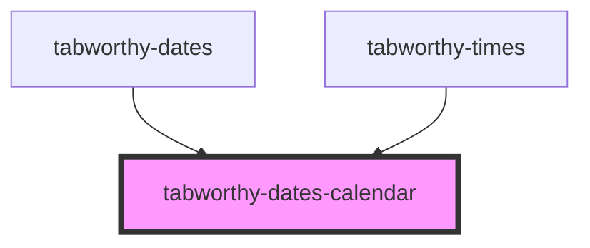

# tabworthy-dates-calendar

<!-- Auto Generated Below -->

## Properties

| Property                     | Attribute                       | Description | Type                                                                                                                                                                                                                                                                                                           | Default                            |
| ---------------------------- | ------------------------------- | ----------- | -------------------------------------------------------------------------------------------------------------------------------------------------------------------------------------------------------------------------------------------------------------------------------------------------------------- | ---------------------------------- |
| `clearButtonContent`         | `clear-button-content`          |             | `string`                                                                                                                                                                                                                                                                                                       | `undefined`                        |
| `disableDate`                | --                              |             | `(date: Date) => boolean`                                                                                                                                                                                                                                                                                      | `() => false`                      |
| `disabled`                   | `disabled`                      |             | `boolean`                                                                                                                                                                                                                                                                                                      | `false`                            |
| `elementClassName`           | `element-class-name`            |             | `string`                                                                                                                                                                                                                                                                                                       | `"tabworthy-dates-calendar"`       |
| `firstDayOfWeek`             | `first-day-of-week`             |             | `number`                                                                                                                                                                                                                                                                                                       | `0`                                |
| `inline`                     | `inline`                        |             | `boolean`                                                                                                                                                                                                                                                                                                      | `false`                            |
| `labels`                     | --                              |             | `{ clearButton: string; monthSelect: string; nextMonthButton: string; nextYearButton: string; picker: string; previousMonthButton: string; previousYearButton: string; todayButton: string; yearSelect: string; keyboardHint: string; selected: string; chooseAsStartDate: string; chooseAsEndDate: string; }` | `defaultLabels`                    |
| `locale`                     | `locale`                        |             | `string`                                                                                                                                                                                                                                                                                                       | `navigator?.language \|\| "en-US"` |
| `maxDate`                    | `max-date`                      |             | `string`                                                                                                                                                                                                                                                                                                       | `undefined`                        |
| `minDate`                    | `min-date`                      |             | `string`                                                                                                                                                                                                                                                                                                       | `undefined`                        |
| `modalIsOpen`                | `modal-is-open`                 |             | `boolean`                                                                                                                                                                                                                                                                                                      | `false`                            |
| `nextMonthButtonContent`     | `next-month-button-content`     |             | `string`                                                                                                                                                                                                                                                                                                       | `undefined`                        |
| `nextYearButtonContent`      | `next-year-button-content`      |             | `string`                                                                                                                                                                                                                                                                                                       | `undefined`                        |
| `previousMonthButtonContent` | `previous-month-button-content` |             | `string`                                                                                                                                                                                                                                                                                                       | `undefined`                        |
| `previousYearButtonContent`  | `previous-year-button-content`  |             | `string`                                                                                                                                                                                                                                                                                                       | `undefined`                        |
| `range`                      | `range`                         |             | `boolean`                                                                                                                                                                                                                                                                                                      | `false`                            |
| `showClearButton`            | `show-clear-button`             |             | `boolean`                                                                                                                                                                                                                                                                                                      | `false`                            |
| `showHiddenTitle`            | `show-hidden-title`             |             | `boolean`                                                                                                                                                                                                                                                                                                      | `true`                             |
| `showKeyboardHint`           | `show-keyboard-hint`            |             | `boolean`                                                                                                                                                                                                                                                                                                      | `false`                            |
| `showMonthStepper`           | `show-month-stepper`            |             | `boolean`                                                                                                                                                                                                                                                                                                      | `true`                             |
| `showTodayButton`            | `show-today-button`             |             | `boolean`                                                                                                                                                                                                                                                                                                      | `true`                             |
| `showYearStepper`            | `show-year-stepper`             |             | `boolean`                                                                                                                                                                                                                                                                                                      | `false`                            |
| `startDate`                  | `start-date`                    |             | `string`                                                                                                                                                                                                                                                                                                       | `getISODateString(new Date())`     |
| `todayButtonContent`         | `today-button-content`          |             | `string`                                                                                                                                                                                                                                                                                                       | `undefined`                        |
| `value`                      | --                              |             | `Date \| Date[]`                                                                                                                                                                                                                                                                                               | `undefined`                        |

## Events

| Event         | Description | Type                                    |
| ------------- | ----------- | --------------------------------------- |
| `changeMonth` |             | `CustomEvent<MonthChangedEventDetails>` |
| `changeYear`  |             | `CustomEvent<YearChangedEventDetails>`  |
| `selectDate`  |             | `CustomEvent<string \| string[]>`       |

## Dependencies

### Used by

- [tabworthy-dates](../tabworthy-dates)
- [tabworthy-times](../tabworthy-times)

### Graph

---

_Built with [StencilJS](https://stenciljs.com/)_
