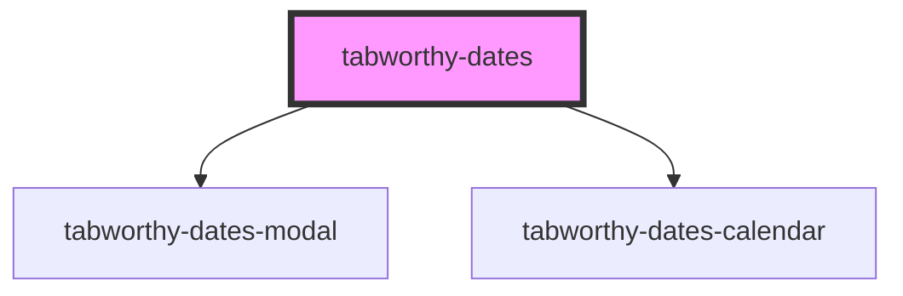

# tabworthy-dates

<!-- Auto Generated Below -->

## Properties

| Property                 | Attribute                   | Description | Type                                                                                                                                                                                                                                                                                                           | Default                                                                                                           |
| ------------------------ | --------------------------- | ----------- | -------------------------------------------------------------------------------------------------------------------------------------------------------------------------------------------------------------------------------------------------------------------------------------------------------------- | ----------------------------------------------------------------------------------------------------------------- |
| `calendarButtonContent`  | `calendar-button-content`   |             | `string`                                                                                                                                                                                                                                                                                                       | `undefined`                                                                                                       |
| `datesCalendarLabels`    | --                          |             | `{ clearButton: string; monthSelect: string; nextMonthButton: string; nextYearButton: string; picker: string; previousMonthButton: string; previousYearButton: string; todayButton: string; yearSelect: string; keyboardHint: string; selected: string; chooseAsStartDate: string; chooseAsEndDate: string; }` | `undefined`                                                                                                       |
| `datesLabels`            | --                          |             | `DatesLabels`                                                                                                                                                                                                                                                                                                  | `defaultLabels`                                                                                                   |
| `disableDate`            | --                          |             | `(date: Date) => boolean`                                                                                                                                                                                                                                                                                      | `() =>     false`                                                                                                 |
| `disabled`               | `disabled`                  |             | `boolean`                                                                                                                                                                                                                                                                                                      | `false`                                                                                                           |
| `elementClassName`       | `element-class-name`        |             | `string`                                                                                                                                                                                                                                                                                                       | `"tabworthy-dates"`                                                                                               |
| `firstDayOfWeek`         | `first-day-of-week`         |             | `number`                                                                                                                                                                                                                                                                                                       | `1`                                                                                                               |
| `format`                 | `format`                    |             | `string`                                                                                                                                                                                                                                                                                                       | `"YYYY-MM-DD"`                                                                                                    |
| `hasError`               | `has-error`                 |             | `boolean`                                                                                                                                                                                                                                                                                                      | `false`                                                                                                           |
| `id` _(required)_        | `id`                        |             | `string`                                                                                                                                                                                                                                                                                                       | `undefined`                                                                                                       |
| `inline`                 | `inline`                    |             | `boolean`                                                                                                                                                                                                                                                                                                      | `false`                                                                                                           |
| `inputShouldFormat`      | `input-should-format`       |             | `boolean \| string`                                                                                                                                                                                                                                                                                            | `true`                                                                                                            |
| `label`                  | `label`                     |             | `string`                                                                                                                                                                                                                                                                                                       | `this.range     ? "Choose a date range (any way you like)"     : "Choose a date (any way you like)"`              |
| `locale`                 | `locale`                    |             | `string`                                                                                                                                                                                                                                                                                                       | `navigator?.language \|\| "en-US"`                                                                                |
| `maxDate`                | `max-date`                  |             | `string`                                                                                                                                                                                                                                                                                                       | `undefined`                                                                                                       |
| `minDate`                | `min-date`                  |             | `string`                                                                                                                                                                                                                                                                                                       | `undefined`                                                                                                       |
| `nextMonthButtonContent` | `next-month-button-content` |             | `string`                                                                                                                                                                                                                                                                                                       | `undefined`                                                                                                       |
| `nextYearButtonContent`  | `next-year-button-content`  |             | `string`                                                                                                                                                                                                                                                                                                       | `undefined`                                                                                                       |
| `placeholder`            | `placeholder`               |             | `string`                                                                                                                                                                                                                                                                                                       | `` this.range     ? `Try "June 8 to 12"`     : `Try "tomorrrow" or "in ten days"` ``                              |
| `quickButtons`           | --                          |             | `string[]`                                                                                                                                                                                                                                                                                                     | `this.range     ? ["Monday to Wednesday", "July 5 to 10"]     : ["Yesterday", "Today", "Tomorrow", "In 10 days"]` |
| `range`                  | `range`                     |             | `boolean`                                                                                                                                                                                                                                                                                                      | `false`                                                                                                           |
| `referenceDate`          | `reference-date`            |             | `string`                                                                                                                                                                                                                                                                                                       | `getISODateString(new Date())`                                                                                    |
| `showClearButton`        | `show-clear-button`         |             | `boolean`                                                                                                                                                                                                                                                                                                      | `true`                                                                                                            |
| `showKeyboardHint`       | `show-keyboard-hint`        |             | `boolean`                                                                                                                                                                                                                                                                                                      | `false`                                                                                                           |
| `showMonthStepper`       | `show-month-stepper`        |             | `boolean`                                                                                                                                                                                                                                                                                                      | `true`                                                                                                            |
| `showQuickButtons`       | `show-quick-buttons`        |             | `boolean`                                                                                                                                                                                                                                                                                                      | `true`                                                                                                            |
| `showTodayButton`        | `show-today-button`         |             | `boolean`                                                                                                                                                                                                                                                                                                      | `true`                                                                                                            |
| `showYearStepper`        | `show-year-stepper`         |             | `boolean`                                                                                                                                                                                                                                                                                                      | `false`                                                                                                           |
| `startDate`              | `start-date`                |             | `string`                                                                                                                                                                                                                                                                                                       | `getISODateString(new Date())`                                                                                    |
| `todayButtonContent`     | `today-button-content`      |             | `string`                                                                                                                                                                                                                                                                                                       | `undefined`                                                                                                       |
| `useStrictDateParsing`   | `use-strict-date-parsing`   |             | `boolean`                                                                                                                                                                                                                                                                                                      | `false`                                                                                                           |
| `value`                  | `value`                     |             | `string \| string[]`                                                                                                                                                                                                                                                                                           | `undefined`                                                                                                       |

## Events

| Event            | Description | Type                                   |
| ---------------- | ----------- | -------------------------------------- |
| `changeYear`     |             | `CustomEvent<YearChangedEventDetails>` |
| `componentReady` |             | `CustomEvent<void>`                    |
| `selectDate`     |             | `CustomEvent<string \| string[]>`      |

## Methods

### `parseDate(text: string, shouldSetValue?: boolean, chronoOptions?: ChronoOptions | undefined) => Promise<ChronoParsedDateString>`

#### Parameters

| Name             | Type            | Description |
| ---------------- | --------------- | ----------- |
| `text`           | `string`        |             |
| `shouldSetValue` | `boolean`       |             |
| `chronoOptions`  | `ChronoOptions` |             |

#### Returns

Type: `Promise<ChronoParsedDateString>`

## Dependencies

### Depends on

- [tabworthy-dates-modal](../tabworthy-modal)
- [tabworthy-dates-calendar](../tabworthy-dates-calendar)

### Graph

---

_Built with [StencilJS](https://stenciljs.com/)_
