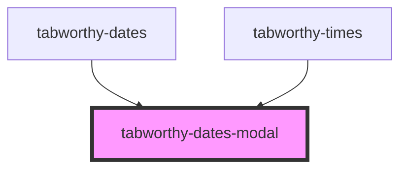

# tabworthy-dates-modal

<!-- Auto Generated Below -->

## Properties

| Property             | Attribute | Description | Type      | Default     |
| -------------------- | --------- | ----------- | --------- | ----------- |
| `inline`             | `inline`  |             | `boolean` | `false`     |
| `label` _(required)_ | `label`   |             | `string`  | `undefined` |

## Events

| Event    | Description | Type               |
| -------- | ----------- | ------------------ |
| `closed` |             | `CustomEvent<any>` |
| `opened` |             | `CustomEvent<any>` |

## Methods

### `close() => Promise<void>`

Close the dialog.

#### Returns

Type: `Promise<void>`

### `getState() => Promise<boolean>`

#### Returns

Type: `Promise<boolean>`

### `open() => Promise<void>`

Open the dialog.

#### Returns

Type: `Promise<void>`

### `setTriggerElement(element: HTMLElement) => Promise<void>`

#### Parameters

| Name      | Type          | Description |
| --------- | ------------- | ----------- |
| `element` | `HTMLElement` |             |

#### Returns

Type: `Promise<void>`

## Slots

| Slot     | Description        |
| -------- | ------------------ |
| `"slot"` | The dialog content |

## Shadow Parts

| Part        | Description |
| ----------- | ----------- |
| `"body"`    |             |
| `"content"` |             |

## Dependencies

### Used by

 - [tabworthy-dates](../tabworthy-dates)
 - [tabworthy-times](../tabworthy-times)

### Graph

----------------------------------------------

*Built with [StencilJS](https://stenciljs.com/)*
