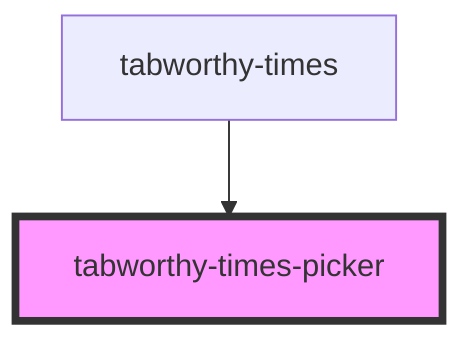

# tabworthy-times-picker

<!-- Auto Generated Below -->

## Properties

| Property           | Attribute             | Description | Type                          | Default                    |
| ------------------ | --------------------- | ----------- | ----------------------------- | -------------------------- |
| `disabled`         | `disabled`            |             | `boolean`                     | `false`                    |
| `elementClassName` | `element-class-name`  |             | `string`                      | `"tabworthy-times-picker"` |
| `hours`            | `hours`               |             | `number`                      | `12`                       |
| `labels`           | --                    |             | `InclusivekTimesPickerLabels` | `defaultLabels`            |
| `labelsSrOnly`     | `labels-sr-only`      |             | `boolean`                     | `true`                     |
| `minutes`          | `minutes`             |             | `number`                      | `0`                        |
| `use12HourFormat`  | `use-1-2-hour-format` |             | `boolean`                     | `false`                    |

## Events

| Event         | Description | Type                     |
| ------------- | ----------- | ------------------------ |
| `timeChanged` |             | `CustomEvent<TimeValue>` |

## Dependencies

### Used by

- [tabworthy-times](../tabworthy-times)

### Graph

---

_Built with [StencilJS](https://stenciljs.com/)_
