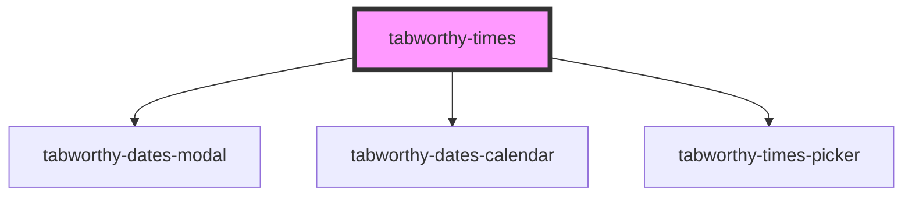

# tabworthy-times

<!-- Auto Generated Below -->

## Properties

| Property                | Attribute                 | Description | Type                                                                                                                                                                                                                                                                                                           | Default                            |
| ----------------------- | ------------------------- | ----------- | -------------------------------------------------------------------------------------------------------------------------------------------------------------------------------------------------------------------------------------------------------------------------------------------------------------- | ---------------------------------- |
| `calendarButtonContent` | `calendar-button-content` |             | `string`                                                                                                                                                                                                                                                                                                       | `undefined`                        |
| `datesCalendarLabels`   | --                        |             | `{ clearButton: string; monthSelect: string; nextMonthButton: string; nextYearButton: string; picker: string; previousMonthButton: string; previousYearButton: string; todayButton: string; yearSelect: string; keyboardHint: string; selected: string; chooseAsStartDate: string; chooseAsEndDate: string; }` | `undefined`                        |
| `disableDate`           | --                        |             | `(date: Date) => boolean`                                                                                                                                                                                                                                                                                      | `() => false`                      |
| `disabled`              | `disabled`                |             | `boolean`                                                                                                                                                                                                                                                                                                      | `false`                            |
| `elementClassName`      | `element-class-name`      |             | `string`                                                                                                                                                                                                                                                                                                       | `"tabworthy-times"`                |
| `firstDayOfWeek`        | `first-day-of-week`       |             | `number`                                                                                                                                                                                                                                                                                                       | `1`                                |
| `format`                | `format`                  |             | `string`                                                                                                                                                                                                                                                                                                       | `"YYYY-MM-DDTHH:mm:ss"`            |
| `hasError`              | `has-error`               |             | `boolean`                                                                                                                                                                                                                                                                                                      | `false`                            |
| `id` _(required)_       | `id`                      |             | `string`                                                                                                                                                                                                                                                                                                       | `undefined`                        |
| `inline`                | `inline`                  |             | `boolean`                                                                                                                                                                                                                                                                                                      | `false`                            |
| `label`                 | `label`                   |             | `string`                                                                                                                                                                                                                                                                                                       | `"Choose a date and time"`         |
| `locale`                | `locale`                  |             | `string`                                                                                                                                                                                                                                                                                                       | `navigator?.language \|\| "en-US"` |
| `maxDate`               | `max-date`                |             | `string`                                                                                                                                                                                                                                                                                                       | `undefined`                        |
| `minDate`               | `min-date`                |             | `string`                                                                                                                                                                                                                                                                                                       | `undefined`                        |
| `placeholder`           | `placeholder`             |             | `string`                                                                                                                                                                                                                                                                                                       | `""`                               |
| `range`                 | `range`                   |             | `boolean`                                                                                                                                                                                                                                                                                                      | `false`                            |
| `referenceDate`         | `reference-date`          |             | `string`                                                                                                                                                                                                                                                                                                       | `getISODateString(new Date())`     |
| `showClearButton`       | `show-clear-button`       |             | `boolean`                                                                                                                                                                                                                                                                                                      | `true`                             |
| `showMonthStepper`      | `show-month-stepper`      |             | `boolean`                                                                                                                                                                                                                                                                                                      | `true`                             |
| `showTodayButton`       | `show-today-button`       |             | `boolean`                                                                                                                                                                                                                                                                                                      | `true`                             |
| `showYearStepper`       | `show-year-stepper`       |             | `boolean`                                                                                                                                                                                                                                                                                                      | `false`                            |
| `startDate`             | `start-date`              |             | `string`                                                                                                                                                                                                                                                                                                       | `getISODateString(new Date())`     |
| `timesLabels`           | --                        |             | `TimesLabels`                                                                                                                                                                                                                                                                                                  | `defaultLabels`                    |
| `use12HourFormat`       | `use-1-2-hour-format`     |             | `boolean`                                                                                                                                                                                                                                                                                                      | `true`                             |
| `value`                 | `value`                   |             | `string \| string[]`                                                                                                                                                                                                                                                                                           | `undefined`                        |

## Events

| Event            | Description | Type                                   |
| ---------------- | ----------- | -------------------------------------- |
| `changeYear`     |             | `CustomEvent<YearChangedEventDetails>` |
| `componentReady` |             | `CustomEvent<void>`                    |
| `selectDateTime` |             | `CustomEvent<string \| string[]>`      |

## Methods

### `clearValue() => Promise<void>`

#### Returns

Type: `Promise<void>`

## Dependencies

### Depends on

- [tabworthy-dates-modal](../tabworthy-modal)
- [tabworthy-dates-calendar](../tabworthy-dates-calendar)
- [tabworthy-times-picker](../tabworthy-times-picker)

### Graph

----------------------------------------------

*Built with [StencilJS](https://stenciljs.com/)*
